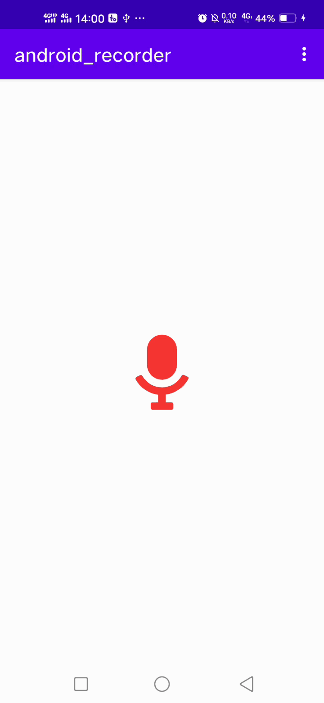

## Eazy Record Button
一款简单的录音及播放控件；支持自定义录音最大时长及录音条数；
录音文件存放地址为：
>Android/data/应用包名/cache/recorder


## Screenshots:



## 用法
步骤1.将JitPack存储库添加到您的project的build.gradle中：

```
allprojects {
		repositories {
			...
			maven { url 'https://jitpack.io' }
		}
	}
```

步骤2.添加依赖
```
dependencies {
	        implementation 'com.github.NicoTic:recordbtn:V1.0.0'
	}
```

有问题请提[issues](https://github.com/NicoTic/recordbtn/issues)